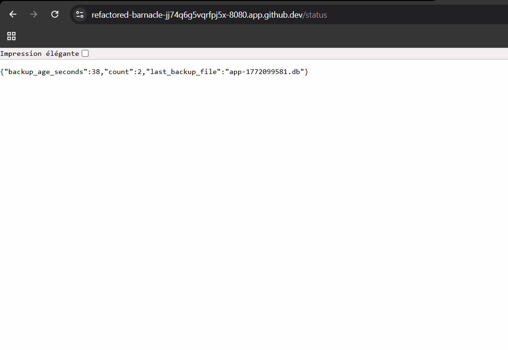

------------------------------------------------------------------------------------------------------
ATELIER PRA/PCA
------------------------------------------------------------------------------------------------------
L’idée en 30 secondes : Cet atelier met en œuvre un **mini-PRA** sur **Kubernetes** en déployant une **application Flask** avec une **base SQLite** stockée sur un **volume persistant (PVC pra-data)** et des **sauvegardes automatiques réalisées chaque minute vers un second volume (PVC pra-backup)** via un **CronJob**. L’**image applicative est construite avec Packer** et le **déploiement orchestré avec Ansible**, tandis que Kubernetes assure la gestion des pods et de la disponibilité applicative. Nous observerons la différence entre **disponibilité** (recréation automatique des pods sans perte de données) et **reprise après sinistre** (perte volontaire du volume de données puis restauration depuis les backups), nous mesurerons concrètement les RTO et RPO, et comprendrons les limites d’un PRA local non répliqué. Cet atelier illustre de manière pratique les principes de continuité et de reprise d’activité, ainsi que le rôle respectif des conteneurs, du stockage persistant et des mécanismes de sauvegarde.
  
**Architecture cible :** Ci-dessous, voici l'architecture cible souhaitée.   
  
  
  
-------------------------------------------------------------------------------------------------------
Séquence 1 : Codespace de Github
-------------------------------------------------------------------------------------------------------
Objectif : Création d'un Codespace Github  
Difficulté : Très facile (~5 minutes)
-------------------------------------------------------------------------------------------------------
**Faites un Fork de ce projet**. Si besoin, voici une vidéo d'accompagnement pour vous aider à "Forker" un Repository Github : [Forker ce projet](https://youtu.be/p33-7XQ29zQ) 
  
Ensuite depuis l'onglet **[CODE]** de votre nouveau Repository, **ouvrez un Codespace Github**.
  
---------------------------------------------------
Séquence 2 : Création du votre environnement de travail
---------------------------------------------------
Objectif : Créer votre environnement de travail  
Difficulté : Simple (~10 minutes)
---------------------------------------------------
Vous allez dans cette séquence mettre en place un cluster Kubernetes K3d contenant un master et 2 workers, installer les logiciels Packer et Ansible. Depuis le terminal de votre Codespace copier/coller les codes ci-dessous étape par étape :  

**Création du cluster K3d**  
```
curl -s https://raw.githubusercontent.com/k3d-io/k3d/main/install.sh | bash
```
```
k3d cluster create pra \
  --servers 1 \
  --agents 2
```
**vérification de la création de votre cluster Kubernetes**  
```
kubectl get nodes
```
**Installation du logiciel Packer (création d'images Docker)**  
```
PACKER_VERSION=1.11.2
curl -fsSL -o /tmp/packer.zip \
  "https://releases.hashicorp.com/packer/${PACKER_VERSION}/packer_${PACKER_VERSION}_linux_amd64.zip"
sudo unzip -o /tmp/packer.zip -d /usr/local/bin
rm -f /tmp/packer.zip
```
**Installation du logiciel Ansible**  
```
python3 -m pip install --user ansible kubernetes PyYAML jinja2
export PATH="$HOME/.local/bin:$PATH"
ansible-galaxy collection install kubernetes.core
```
  
---------------------------------------------------
Séquence 3 : Déploiement de l'infrastructure
---------------------------------------------------
Objectif : Déployer l'infrastructure sur le cluster Kubernetes
Difficulté : Facile (~15 minutes)
---------------------------------------------------  
Nous allons à présent déployer notre infrastructure sur Kubernetes. C'est à dire, créér l'image Docker de notre application Flask avec Packer, déposer l'image dans le cluster Kubernetes et enfin déployer l'infratructure avec Ansible (Création du pod, création des PVC et les scripts des sauvegardes aututomatiques).  

**Création de l'image Docker avec Packer**  
```
packer init .
packer build -var "image_tag=1.0" .
docker images | head
```
  
**Import de l'image Docker dans le cluster Kubernetes**  
```
k3d image import pra/flask-sqlite:1.0 -c pra
```
  
**Déploiment de l'infrastructure dans Kubernetes**  
```
ansible-playbook ansible/playbook.yml
```
  
**Forward du port 8080 qui est le port d'exposition de votre application Flask**  
```
kubectl -n pra port-forward svc/flask 8080:80 >/tmp/web.log 2>&1 &
```
  
---------------------------------------------------  
**Réccupération de l'URL de votre application Flask**. Votre application Flask est déployée sur le cluster K3d. Pour obtenir votre URL cliquez sur l'onglet **[PORTS]** dans votre Codespace (à coté de Terminal) et rendez public votre port 8080 (Visibilité du port). Ouvrez l'URL dans votre navigateur et c'est terminé.  

**Les routes** à votre disposition sont les suivantes :  
1. https://...**/** affichera dans votre navigateur "Bonjour tout le monde !".
2. https://...**/health** pour voir l'état de santé de votre application.
3. https://...**/add?message=test** pour ajouter un message dans votre base de données SQLite.
4. https://...**/count** pour afficher le nombre de messages stockés dans votre base de données SQLite.
5. https://...**/consultation** pour afficher les messages stockés dans votre base de données.
  
---------------------------------------------------  
### Processus de sauvegarde de la BDD SQLite

Grâce à une tâche CRON déployée par Ansible sur le cluster Kubernetes (un CronJob), toutes les minutes une sauvegarde de la BDD SQLite est faite depuis le PVC pra-data vers le PCV pra-backup dans Kubernetes.  

Pour visualiser les sauvegardes périodiques déposées dans le PVC pra-backup, coller les commandes suivantes dans votre terminal Codespace :  

```
kubectl -n pra run debug-backup \
  --rm -it \
  --image=alpine \
  --overrides='
{
  "spec": {
    "containers": [{
      "name": "debug",
      "image": "alpine",
      "command": ["sh"],
      "stdin": true,
      "tty": true,
      "volumeMounts": [{
        "name": "backup",
        "mountPath": "/backup"
      }]
    }],
    "volumes": [{
      "name": "backup",
      "persistentVolumeClaim": {
        "claimName": "pra-backup"
      }
    }]
  }
}'
```
```
ls -lh /backup
```
**Pour sortir du cluster et revenir dans le terminal**
```
exit
```

---------------------------------------------------
Séquence 4 : 💥 Scénarios de crash possibles  
Difficulté : Facile (~30 minutes)
---------------------------------------------------
### 🎬 **Scénario 1 : PCA — Crash du pod**  
Nous allons dans ce scénario **détruire notre Pod Kubernetes**. Ceci simulera par exemple la supression d'un pod accidentellement, ou un pod qui crash, ou un pod redémarré, etc..

**Destruction du pod :** Ci-dessous, la cible de notre scénario   
  
  

Nous perdons donc ici notre application mais pas notre base de données puisque celle-ci est déposée dans le PVC pra-data hors du pod.  

Copier/coller le code suivant dans votre terminal Codespace pour détruire votre pod :
```
kubectl -n pra get pods
```
Notez le nom de votre pod qui est différent pour tout le monde.  
Supprimez votre pod (pensez à remplacer <nom-du-pod-flask> par le nom de votre pod).  
Exemple : kubectl -n pra delete pod flask-7c4fd76955-abcde  
```
kubectl -n pra delete pod <nom-du-pod-flask>
```
**Vérification de la suppression de votre pod**
```
kubectl -n pra get pods
```
👉 **Le pod a été reconstruit sous un autre identifiant**.  
Forward du port 8080 du nouveau service  
```
kubectl -n pra port-forward svc/flask 8080:80 >/tmp/web.log 2>&1 &
```
Observez le résultat en ligne  
https://...**/consultation** -> Vous n'avez perdu aucun message.
  
👉 Kubernetes gère tout seul : Aucun impact sur les données ou sur votre service (PVC conserve la DB et le pod est reconstruit automatiquement) -> **C'est du PCA**. Tout est automatique et il n'y a aucune rupture de service.
  
---------------------------------------------------
### 🎬 **Scénario 2 : PRA - Perte du PVC pra-data** 
Nous allons dans ce scénario **détruire notre PVC pra-data**. C'est à dire nous allons suprimer la base de données en production. Ceci simulera par exemple la corruption de la BDD SQLite, le disque du node perdu, une erreur humaine, etc. 💥 Impact : IL s'agit ici d'un impact important puisque **la BDD est perdue**.  

**Destruction du PVC pra-data :** Ci-dessous, la cible de notre scénario   
  
  

🔥 **PHASE 1 — Simuler le sinistre (perte de la BDD de production)**  
Copier/coller le code suivant dans votre terminal Codespace pour détruire votre base de données :
```
kubectl -n pra scale deployment flask --replicas=0
```
```
kubectl -n pra patch cronjob sqlite-backup -p '{"spec":{"suspend":true}}'
```
```
kubectl -n pra delete job --all
```
```
kubectl -n pra delete pvc pra-data
```
👉 Vous pouvez vérifier votre application en ligne, la base de données est détruite et la service n'est plus accéssible.  

✅ **PHASE 2 — Procédure de restauration**  
Recréer l’infrastructure avec un PVC pra-data vide.  
```
kubectl apply -f k8s/
```
Vérification de votre application en ligne.  
Forward du port 8080 du service pour tester l'application en ligne.  
```
kubectl -n pra port-forward svc/flask 8080:80 >/tmp/web.log 2>&1 &
```
https://...**/count** -> =0.  
https://...**/consultation** Vous avez perdu tous vos messages.  

Retaurez votre BDD depuis le PVC Backup.  
```
kubectl apply -f pra/50-job-restore.yaml
```
👉 Vous pouvez vérifier votre application en ligne, **votre base de données a été restaureé** et tous vos messages sont bien présents.  

Relance des CRON de sauvgardes.  
```
kubectl -n pra patch cronjob sqlite-backup -p '{"spec":{"suspend":false}}'
```
👉 Nous n'avons pas perdu de données mais Kubernetes ne gère pas la restauration tout seul. Nous avons du protéger nos données via des sauvegardes régulières (du PVC pra-data vers le PVC pra-backup). -> **C'est du PRA**. Il s'agit d'une stratégie de sauvegarde avec une procédure de restauration.  

---------------------------------------------------
Séquence 5 : Exercices  
Difficulté : Moyenne (~45 minutes)
---------------------------------------------------
**Complétez et documentez ce fichier README.md** pour répondre aux questions des exercices.  
Faites preuve de pédagogie et soyez clair dans vos explications et procedures de travail.  

**Exercice 1 :**  
Quels sont les composants dont la perte entraîne une perte de données ?  
  
**Réponse :**  
Dans cette architecture, **seul le PVC pra-data** est un point critique dont la perte entraîne une perte de données irréversible (à moins de disposer d'un backup) :

- **PVC pra-data** : **CRITIQUE** — Contient la base de données SQLite. Sa destruction entraîne la perte immédiate de toutes les données.
- **Pod Flask** : Non critique — En cas de suppression, Kubernetes le recrée automatiquement grâce au Deployment.yml. Les données sont préservées car elles sont sur le PVC (stockage persistant).
- **PVC pra-backup** : Non critique pour les données courantes, mais **ESSENTIEL pour le PRA** — Contient les sauvegardes. Sa perte compromet la stratégie de reprise.
- **CronJob** : Non critique — En cas de suppression, il peut être restauré depuis les manifests Kubernetes.

**Conclusion :** Le stockage persistant (PVC) est le seul composant dont la perte provoque une perte de données. C'est pourquoi les stratégies de sauvegarde doivent protéger ce composant critique.

**Exercice 2 :**  
Expliquez nous pourquoi nous n'avons pas perdu les données lors de la supression du PVC pra-data  
  
**Réponse :**  
Bien que nous ayons supprimé le PVC pra-data (et donc physiquement détruit la base de données), nous n'avons pas perdu les données pour une raison simple : **nous disposions de sauvegardes régulières dans le PVC pra-backup**.

**Mécanisme de sauvegarde :**
- Un CronJob exécute une sauvegarde **toutes les minutes**
- Cette tâche copie la base de données SQLite du PVC pra-data vers le PVC pra-backup
- Le PVC pra-backup se trouve sur le même cluster, protégeant ainsi les données contre la perte du volume primaire

**Processus de récupération :**
1. Suppression accidentelle du PVC pra-data → Données perdues du volume primaire
2. Recréation d'un nouveau PVC pra-data vide (via `kubectl apply -f k8s/`) → Service revient en ligne mais compte des messages = 0
3. Exécution du job de restauration (`kubectl apply -f pra/50-job-restore.yaml`) → Copie du backup depuis pra-backup vers le nouveau pra-data
4. Les données sont restaurées avec un maximum 1 minute de perte (l'intervalle entre deux sauvegardes)

**Apprentissage clé :** Sans sauvegarde, cette opération aurait entraîné une perte définitive des données. Les sauvegardes régulières sont la clé du PRA.

**Exercice 3 :**  
Quels sont le RTO et RPO de cette solution ?  
  
**Réponse :**  

**RPO (Recovery Point Objective) = 1 minute**
- Definition : Quantité maximum de données que vous êtes prêt à perdre en cas de sinistre
- Dans cette solution : Les sauvegardes s'exécutent **toutes les minutes**
- Conclusion : En cas de sinistre, vous risquez de perdre au maximum **1 minute de données** (les événements saisis après la dernière sauvegarde)
- Exemple : Si la dernière sauvegarde a eu lieu à 14h30:00 et le sinistre à 14h30:45, vous perdez 45 secondes de données

**RTO (Recovery Time Objective) = 5 à 10 minutes**
- Definition : Temps maximal acceptable pour restaurer le service après un sinistre
- Dans cette solution :
  - Suppression du cluster / détection du sinistre : ~1 minute
  - Recréation du PVC pra-data et du pod : ~2-3 minutes
  - Exécution du job de restauration (copie du backup) : ~2-5 minutes (dépend de la taille des données)
  - Tests de fonctionnalité : ~1 minute
- Conclusion : Le service est restauré en **5 à 10 minutes** en fonction de la taille des données

**Exercice 4 :**  
Pourquoi cette solution (cet atelier) ne peux pas être utilisée dans un vrai environnement de production ? Que manque-t-il ?   
  
**Réponse :**  
Bien que cette solution démontre les principes du PRA, elle présente **plusieurs limitations critiques** pour un environnement de production :

**1. Pas de réplication géographique**
- **Problème** : Tous les éléments (application, données, backups) sont sur le **même cluster physique**
- **Risque** : Une catastrophe affectant le datacenter entier (incendie, panne électrique, tremblement de terre) détruit application ET backups
- **Solution production** : Répliquer les données et backups sur une **région géographique distante**

**2. Backups localisés sur le même cluster**
- **Problème** : Les sauvegardes (PVC pra-backup) et les données (PVC pra-data) résident sur le **même système de stockage**
- **Risque** : Corruption, panne ou attaque affectant l'infrastructure locale détruit données ET backups
- **Solution production** : Exporter les backups vers un **stockage externe** (S3 par exemple) pour garantir leur indépendance

**3. Pas de chiffrement des données**
- **Problème** : Les données et backups circulent et sont stockés en clair
- **Risque** : Accès non autorisé, vol de données, non-conformité réglementaire (RGPD, PCI-DSS)
- **Solution production** : Chiffrer les données **en transit** (TLS) et **au repos** (AES-256)

**4. Pas de monitoring ni d'alerting**
- **Problème** : Aucune visibilité sur l'état des sauvegardes ou la santé de l'infrastructure
- **Risque** : Un backup qui échoue silencieusement découvert trop tard (au moment du sinistre)
- **Solution production** : Mettre en place des alertes si une sauvegarde échoue ou dépasse un délai tolérance créer des dashboards grafana pour le monitoring efficace.

**5. Pas de test régulier de restauration**
- **Problème** : On suppose que les restaurations fonctionnent, mais aucun test n'est effectué
- **Risque** : Découvrir lors d'un sinistre réel que les backups sont corrompus ou inutilisables
- **Solution production** : Avoir un **plan de test regulier** (Disaster Recovery Drills) pour valider les procédures

**6. RTO et RPO trop élevés pour certains métiers**
- **Problème** : Un RTO de 5-10 min et RPO de 1 min ne conviennent pas aux applications critiques
- **Risque** : Moins acceptable selon la criticité du service
- **Solution production** : Mettre en place une **réplication active-active** ou une **haute disponibilité** pour réduire RTO/RPO

**7. Pas de gestion d'audit ni de conformité**
- **Problème** : Aucune trace de qui a accédé, modifié ou restauré les données
- **Risque** : Non-conformité aux standards d'audit et de gouvernance
- **Solution production** : Implémenter des logs d'audit, du versioning des backups, et de la traçabilité

  
**Exercice 5 :**  
Proposez une architecture plus robuste.   
  
**Réponse :**  

Voici une architecture PRA/PCA **production-ready** qui adresse les limitations de la solution actuelle :


```
┌─────────────────────────────────────────────────────────────────────┐
│              STOCKAGE EXTERNALISÉ MULTI-RÉGION                       │
│                                                                      │
│  AWS S3 / Google Cloud Storage / Azure Blob Storage                 │
│  ┌────────────────────────────────────────────────────────────────┐ │
│  │  Backup Bucket (Versioned + Encrypted + Immutable)             │ │
│  │  . Retention: 90 jours                                         │ │
│  │  . Encryption: AES-256 (KMS)                                   │ │
│  │  . Replication: Cross-region (géographique)                   │ │
│  │  . Backup chiffré toutes les minutes                           │ │
│  │  . Snapshots: Horaires + Quotidiens + Hebdomadaires           │ │
│  └────────────────────────────────────────────────────────────────┘ │
└─────────────────────────────────────────────────────────────────────┘
```

**Caractéristiques clés de cette architecture robuste :**

**1. Haute Disponibilité Multi-Région (Active-Active)**
- Deux clusters Kubernetes dans **différentes régions géographiques** (Europe + US)
- Application **répliquée et distribuée** sur les deux régions
- Requêtes routées via **DNS load balancing** (Route 53, Cloud DNS) ou **Anycast IP**
- Avantages :
  - Pas de point unique de défaillance
  - Résilience aux catastrophes régionales
  - Latence réduite pour les utilisateurs proches
  - Continuité de service même en cas d'outage régional complet

**2. Réplication de Données Bidirectionnelle**
- Données synchronisées en temps réel entre les deux clusters
- Technologies possibles : Ceph, Rook, DRBD, ou outils cloud (AWS DMS, GCP Datastream)
- RPO quasi-nul (perte max quelques secondes)
- Permet lecture/write sur les deux côtés (géo-répartition)

**4. Sécurité et Conformité**
- **Chiffrement en transit** : TLS 1.3 pour toutes les communications
- **Chiffrement au repos** : AES-256 pour données et backups (gestion clés via KMS)
- **Immuabilité** : Mode WORM (Write Once Read Many) sur les backups pour éviter la suppression accidentelle

**5. Monitoring et Observabilité**
- **Prometheus** pour les métriques Kubernetes
- **Grafana** pour la visualisation des dashboards (statut backups, réplication, RTO/RPO)
- **Alertes** : PagerDuty si backup échoue ou réplication retardée
- **Traces distribuées** : Jaeger pour tracer les opérations critiques
- **Logs centralisés** : Elasticsearch/Loki pour rechercher rapidement les erreurs

**6. Tests Réguliers des backups**
- Restauration mensuelle d'un backup à vide (test environnement)
- Validation temps de restauration = RTO mesuré
- Documentation de procédures et runbooks
- Plan de communication d'urgence

**7. RTO et RPO Optimisés**
- **RPO** : ≤1 minute (sauvegardes Cloud toutes les minutes)
- **RTO** : ≤5 minutes (basculement automatique via load balancer)
- Possibilité de réduire à **RPO <30sec** et **RTO <1min** avec réplication synchrone


---------------------------------------------------
Séquence 6 : Ateliers  
Difficulté : Moyenne (~2 heures)
---------------------------------------------------
### **Atelier 1 : Ajoutez une fonctionnalité à votre application**  
**Ajouter une route GET /status** dans votre application qui affiche en JSON :
* count : nombre d’événements en base
* last_backup_file : nom du dernier backup présent dans /backup
* backup_age_seconds : âge du dernier backup



---------------------------------------------------
### **Atelier 2 : Choisir notre point de restauration**  
Aujourd’hui nous restaurobs “le dernier backup”. Nous souhaitons **ajouter la capacité de choisir un point de restauration**.

**Procédure de restauration (runbook) :**
1. **Lister les backups disponibles**
   - Ouvrir un shell dans un pod ou utiliser `kubectl -n pra run debug-backup` comme décrit plus haut.
   - Exécuter `ls -1 /backup | sort` pour voir tous les fichiers `app-<timestamp>.db` rangés par ordre chronologique.
   - Notez le nom du fichier correspondant au point de restauration désiré (par exemple `app-1772098321.db`).

2. **Suspendre le cron de sauvegarde** afin d'éviter qu'un job ne copie une nouvelle version pendant la restauration :
   ```bash
   kubectl -n pra patch cronjob sqlite-backup -p '{"spec":{"suspend":true}}'
   ```

3. **Arrêter l'application** (optionnel mais recommandé) :
   ```bash
   kubectl -n pra scale deployment flask --replicas=0
   ```
   Cela garantit qu'aucune écriture n'aura lieu pendant l'opération.

4. **Préparer le volume de données**
   - Si le PVC `pra-data` existe déjà (vide ou non), vous pouvez le supprimer et le recréer en appliquant les manifests :
     ```bash
     kubectl -n pra delete pvc pra-data
     kubectl apply -f k8s/11-pvc-data.yaml
     kubectl apply -f k8s/20-deployment.yaml  # pour recréer le pod si nécessaire
     ```
   - Alternativement, vous pouvez monter le PVC dans un pod de debug et purger manuellement `/data/app.db`.

5. **Copier le backup choisi dans le PVC de données**
   - Créer un job de restauration ad‑hoc en remplaçant la variable dans `pra/50-job-restore.yaml` ou en lançant la commande manuelle :
     ```bash
     kubectl -n pra run restore-chosen --restart=Never --rm -it --image=alpine -- sh -c \
       "cp /backup/app-1772098321.db /data/app.db" \
       -v pra-data:/data -v pra-backup:/backup
     ```
     (adaptez le nom du fichier selon votre sélection)
   - Si vous préférez modifier `pra/50-job-restore.yaml`, mettez le nom dans la ligne `LATEST=$(ls -t /backup/*.db | head -1)` et remplacez la logique par `cp /backup/app-1772098321.db /data/app.db`.

6. **Vérifier la restauration**
   - Relancer l'application si elle a été arrêtée :
     ```bash
     kubectl -n pra scale deployment flask --replicas=1
     ```
   - Attendre que le pod soit prêt (`kubectl -n pra get pods`).
   - Tester avec `/count` et `/consultation` pour s'assurer que les données correspondent au point de restauration choisi.

7. **Redémarrer le cron de sauvegarde** :
   ```bash
   kubectl -n pra patch cronjob sqlite-backup -p '{"spec":{"suspend":false}}'
   ```

8. **(Optionnel) Vérifier le backup actuel** pour confirmer que la prochaine sauvegarde s'exécute correctement et qu'elle reprend à partir de la base restaurée.

> 💡 *Conseil* : conservez un log de la restauration (date, nom du fichier, raison) pour l'audit et la traçabilité.

Cette procédure donne la souplesse de choisir n’importe quel point dans le temps et s’applique dans tous les environnements où les backups sont accessibles.  
  
---------------------------------------------------
Evaluation
---------------------------------------------------
Cet atelier PRA PCA, **noté sur 20 points**, est évalué sur la base du barème suivant :  
- Série d'exerices (5 points)
- Atelier N°1 - Ajout d'un fonctionnalité (4 points)
- Atelier N°2 - Choisir son point de restauration (4 points)
- Qualité du Readme (lisibilité, erreur, ...) (3 points)
- Processus travail (quantité de commits, cohérence globale, interventions externes, ...) (4 points) 

